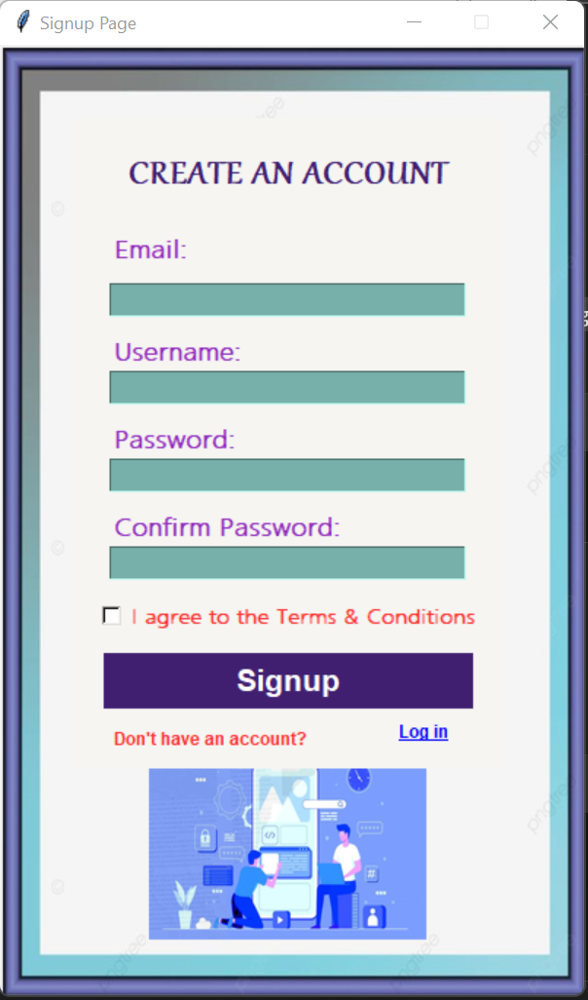
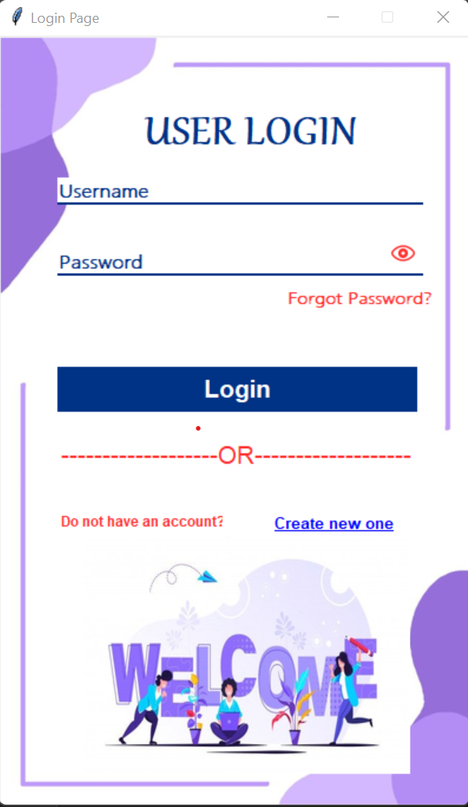
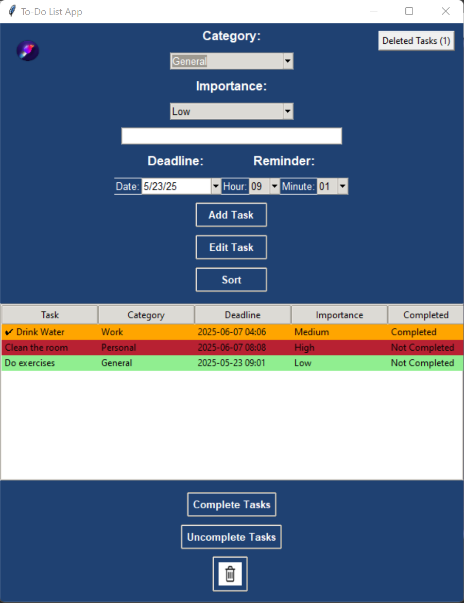

#To-Do List App with User Authentication
Overview
This is a To-Do List application with integrated user authentication, featuring login and signup pages. The app includes task management with customizable themes, reminders, and a visually appealing interface. The signin and signup functionalities are powered by MSSQL using pymysql for database operations.
Features

User Authentication: Login and signup pages with password reset functionality.
Task Management: Add, edit, sort, complete, uncomplete, and delete tasks with categories, importance levels, deadlines, and reminders.
Themes: Switch between Purple, Blue, Green, and Orange modes.
Reminders: Audio and pop-up reminders for task deadlines.
Visuals: Custom images and a welcoming design.

Technologies Used

Frontend: Tkinter, ttk, PIL (for image handling), tkcalendar (for date selection)
Backend: MSSQL (via pymysql for signin/signup)
Audio: Pygame (for reminder and checkmark sounds)
Data Storage: JSON (for completed tasks)
Styling: Custom CSS-like configurations with Tkinter

Prerequisites

Python 3.x
Required libraries: tkinter, ttk, tkcalendar, PIL, pygame, pymysql
MSSQL server with a database named userdata
MySQL credentials (host: localhost, user: root, password: 1234)

Setup

Clone the repository:git clone <repo-url>

Install required packages:pip install tkcalendar Pillow pygame pymysql

Set up the MSSQL database:
Create a database named userdata.
Create a table named data with columns username and password.

Update the database connection in login.py if your MSSQL credentials differ (host, user, password).
Run the application:python login.py

Usage

Login/Signup: Use the login page to authenticate or signup for a new account. Reset password if needed.
Task Management: Add tasks with deadlines and reminders, edit or sort them by category, deadline, importance, or completion status.
Themes: Click the palette icon to switch themes.
Reminders: Set a deadline; the app will notify you with a sound and pop-up.

File Structure

login.py: Handles user login, signup, and password reset.
signup.py: Contains the signup page logic (to be implemented).
main.py: Contains the To-Do List app logic.
Image-sound/: Directory for sound files (e.g., checkmark.mp3, reminder_sound.mp3).
Imagee/: Directory for image files (e.g., bg.png, openeye.png, welcome.png).
completed_tasks.json: Stores deleted tasks.

## App 

Contributing
Feel free to fork this repository and submit pull requests. Suggestions for improvements are welcome!

